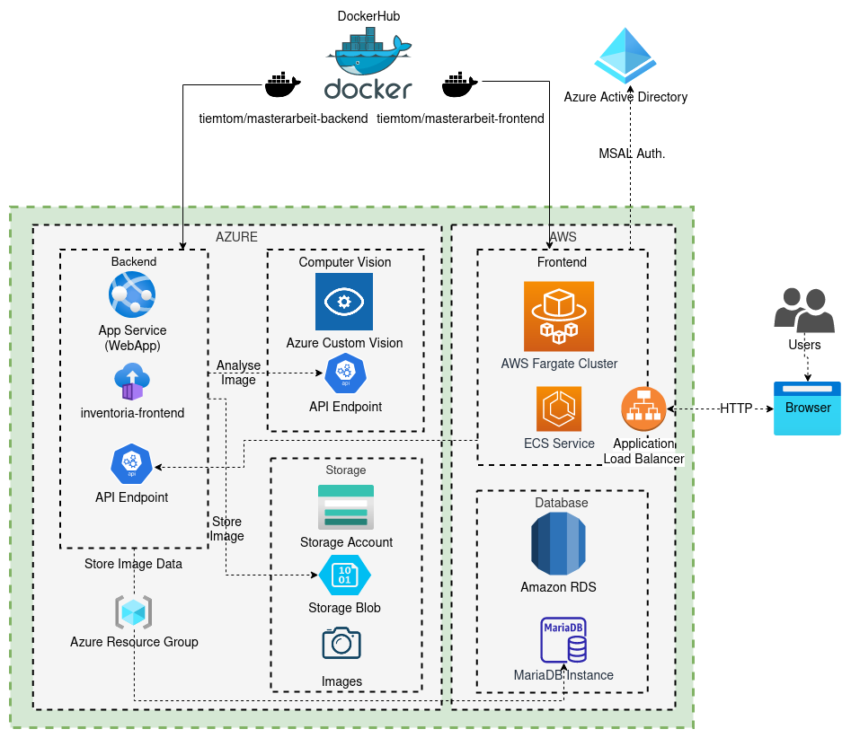
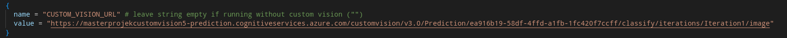
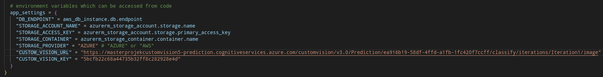
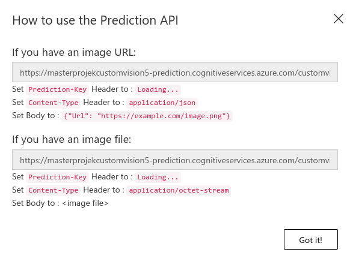
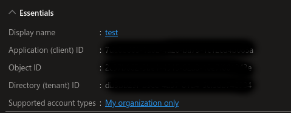
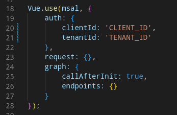
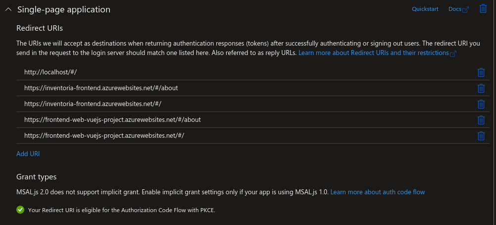
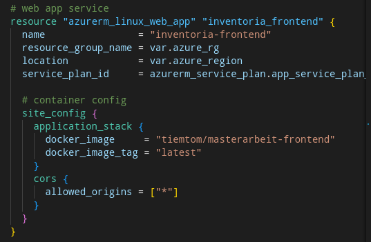
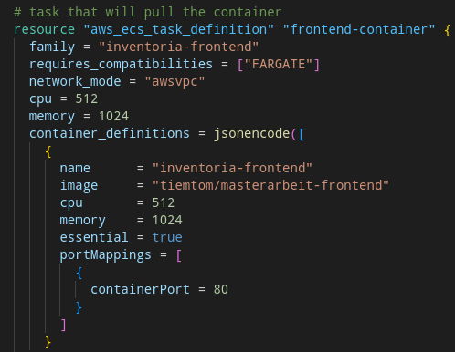

# Inventoria Application
The application was developed as part of a master project at the FH JOANNEUM. It serves as a proof of concept to be hosted as a microservice oriented application hosted in the cloud. The functionality is based around inventory tracking with automated image recognition for easy categorisation.

The application was reworked specifically for a multicloud usecase. 

Link to the original application repository: https://github.com/tiemtom/AIM20-Masterprojekt

## Frontend 
Framework: https://vuejs.org/v2/guide/

UI components: https://buefy.org/documentation

Connection to backend: https://www.npmjs.com/package/vue-axios

Login: https://www.npmjs.com/package/vue-msal

## Backend
Framework: https://fastapi.tiangolo.com/

SQL DB handling: https://www.sqlalchemy.org/

Storage Access: https://libcloud.apache.org/

# Endpoints
| Description | Method | Endpoint |
|--|--|--|
| upload image | POST | `/images` |
| retrieve image list | GET | `/images` optional order and category parameter: `/images?order=<column>&category=<classification>` |
| retrieve/update image info | GET/PUT | `/images/{image_id}` |
| retrieve/update image file | GET/PUT | `/images/{image_id}/image` |
| delete image | DELETE | `/images/{image_id}` |
| validate msal token | GET | `/validate/{msal_token}` |

# Architecture Overview
**Configuration 1**

Other configurations are depicted in the the respective subdirectories (e.g. /terraform/configuration_2)

For the auto categorisation feature to work, the application requires access to a Azure custom vision endpoint, this endpoint can be set in the Terraform configuration files:

**AWS task definition**

**Azure app service**

The custom vision endpoint is not required for the application to work. It is also the only service that is disregarded in the terraform configurations and not easily portable. To run the application without custom vision simply declare the endpoint variable `CUSTOM_VISION_URL` as an empty string.

The URL and API key for a published custom vision prdiction project can be found in the Azure portal.

# Deployment Instructions

## Requirements
A Azure and AWS subscritption is required for the deployment of all configurations.

The machine running the deployment plans requires the installation of:
* **terraform**: https://learn.hashicorp.com/tutorials/terraform/install-cli 
* **azure-cli**: https://docs.microsoft.com/en-us/cli/azure/install-azure-cli
* **aws-cli**: https://aws.amazon.com/cli/ 
* **mariadb client**: https://www.mariadbtutorial.com/getting-started/install-mariadb/ 
* **az storage preview extension**: https://github.com/Azure/azure-cli-extensions/blob/main/src/storage-preview/README.md 

    Installed using azure-cli: `az extension add --name storage-preview`

Out of the box only configuration 3 and 4 can be deployed without altering the application source code. For the other deployments a containerregistry is needed to host the front and backend containers. Details can be found in the section **Altering Front-/Backend Services**.

## Deployment
1. Run `terraform init` in the desired configuration directory. This will download the required provider plugins.

2. Adjust the Terraform `main.tf` files.

3. Log in to Azure and AWS CLI (AWS will use the default profile, this can be adjusted in the main.tf file in the terraform config section)

    Run `az login --tenant <tenant>` and `aws configure`

4. Run `terraform apply` in the config directory. 
    
    Terraform will generate a list of changes and check the configuration for errors. The changes need to be aproved for them to take effect. Terraform will also generate the *terraform.tfstate* file, which contains the current state of the infrastructure.

After the depoyment runs successfully, the backend container will need some more time to pull and start the container. When directly loading the backend endpoint is possible, the application is ready.

To destroy all resources run `terraform destroy` and confirm the changes.

# App Registration
In order to login to the application it needs to be registered with an Azure Active Directory. This can be done in the Azure portal. Once an application was registered, the application client ID and directory tenant ID need to be copied to MSAL config in the `main.js` file, found in the `/frontend-app/src` folder. See the screenshots below for reference.

Client ID and tenant ID in the Azure portal:

MSAL config in the `main.js` file:

Finally, the frontend URLs need to be set in the authentication settings of the registered application in the Azure portal:

# Altering Front-/Backend Services
If back- or frontend code is changed, the services need to be recompiled into a docker image and uploaded to a container registry. The repository hosting the container image needs to be adjusted in the main.tf files:

**Azure:**

**AWS:**

